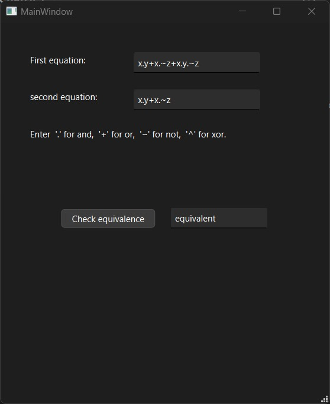
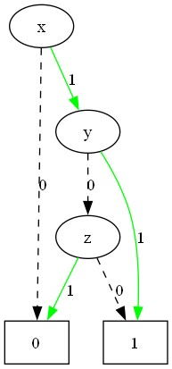
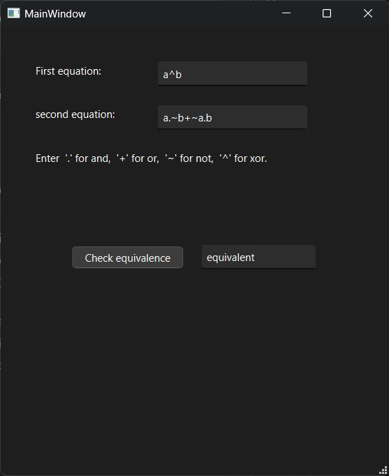
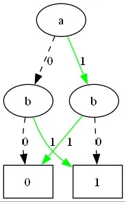

# ROBDD based Equivalent checker

This App takes two Boolean functions and Constructs their Reduced Ordered Binary Decision Diagrams, then checks thier equivalnce based on their binary trees and Creates graphs of the trees.

## Features

- Constructs ROBDD for boolean functions
- Creates graphical results (Graphviz)
- Intuitive GUI (QT) 

## Screenshots

<h3>Application Test-1</h3>

<h3>Graph Test-1</h3>

<h3>Application Test-2</h3>

<h3>Graph Test-2</h3>

